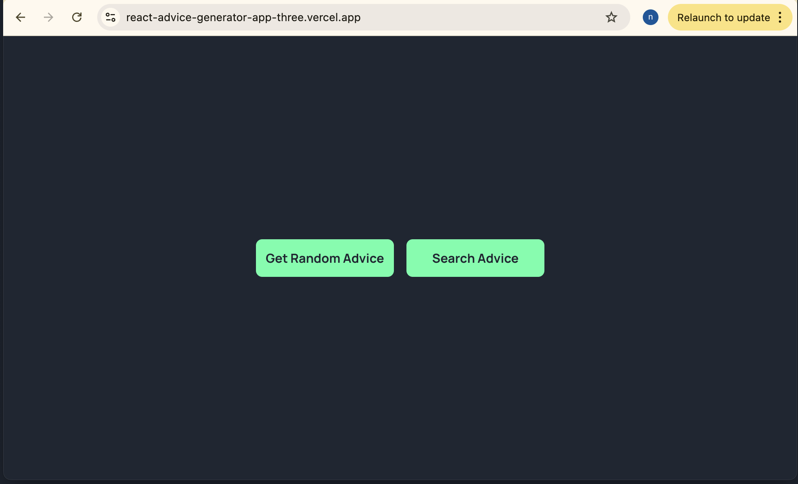
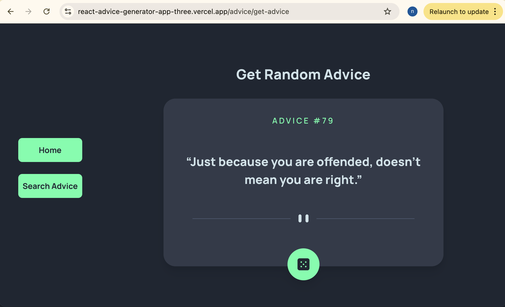
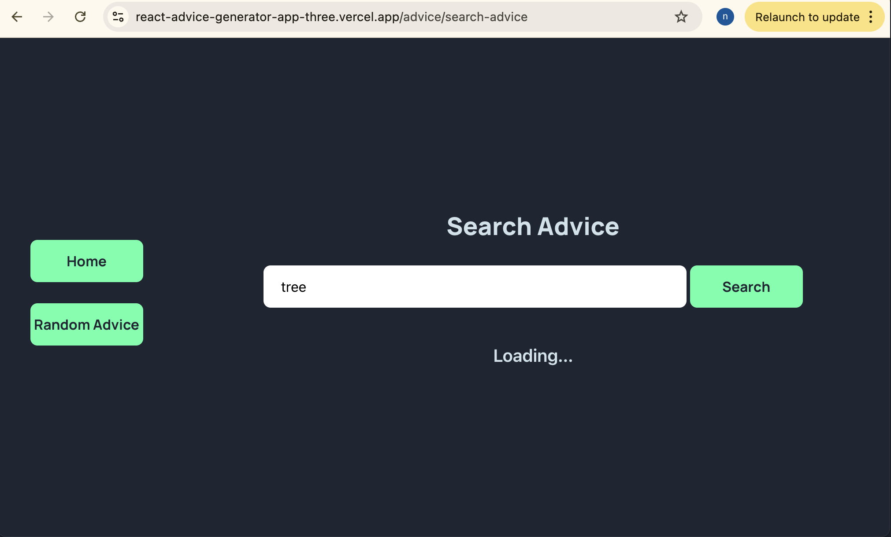
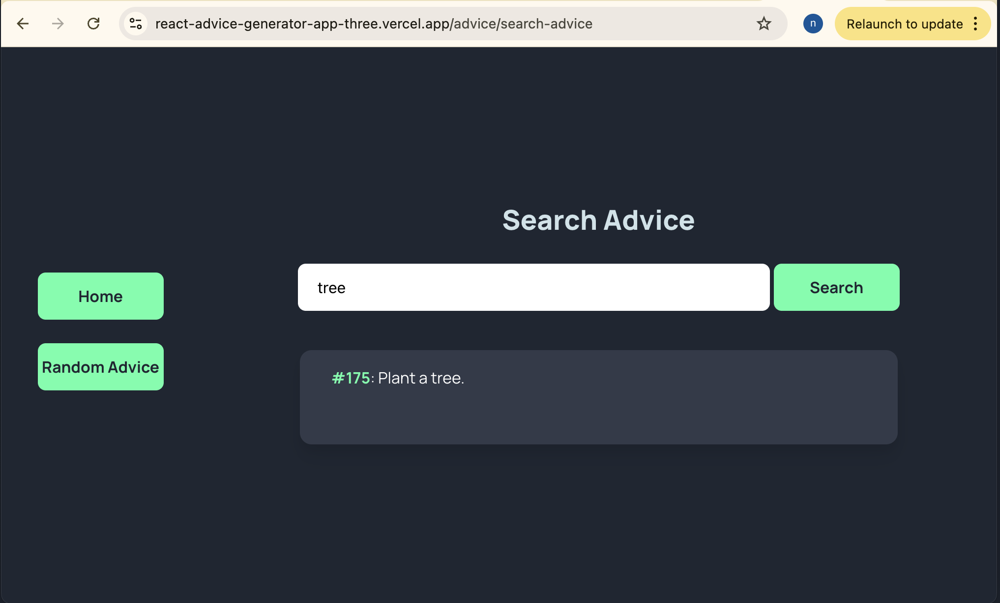

**_Please note that this project is currently under active development. The codebase is subject to change and continuous improvement._**

# react-advice-generator-app

This project is inspired by a [Frontend Mentor](https://www.frontendmentor.io/home) challenge, which involves creating an advice generator app using the [Advice Slip API](https://api.adviceslip.com/).

I extended the challenge to enhance my skills in working with APIs and dockerizing applications. In addition to fetching general advice, I've implemented features like searching for advice by keyword. Additionally, I also built this app using a different tech stack and created a Docker image of the application to further enhance my skills.
You can find the Nextjs version [here](https://github.com/Nella1a/nextjs-advice-generator).

## Setup

1. First, clone the repository. Then, you can run the application either using Docker or locally (without Docker).

```text
git clone https://github.com/Nella1a/react-advice-generator-app.git
cd react-advice-generator-app
```

## Run with Docker

- Make sure that you have a reasonably recent version of docker installed & running
- Make sure you have docker-compose installed

Start the entire application stack

```text
docker compose up
```

Open <http://localhost:5173> on your browser.

## Run Local (without Docker)

Install dependencies

```text
npm run install
```

Run application

```text
npm run dev
```

Open <http://localhost:5173> on your browser.

## Technologies

JavaScript, Reac + Vite, Tailwind CSS, TypeScript, Docker, Vercel

## Screenshots





